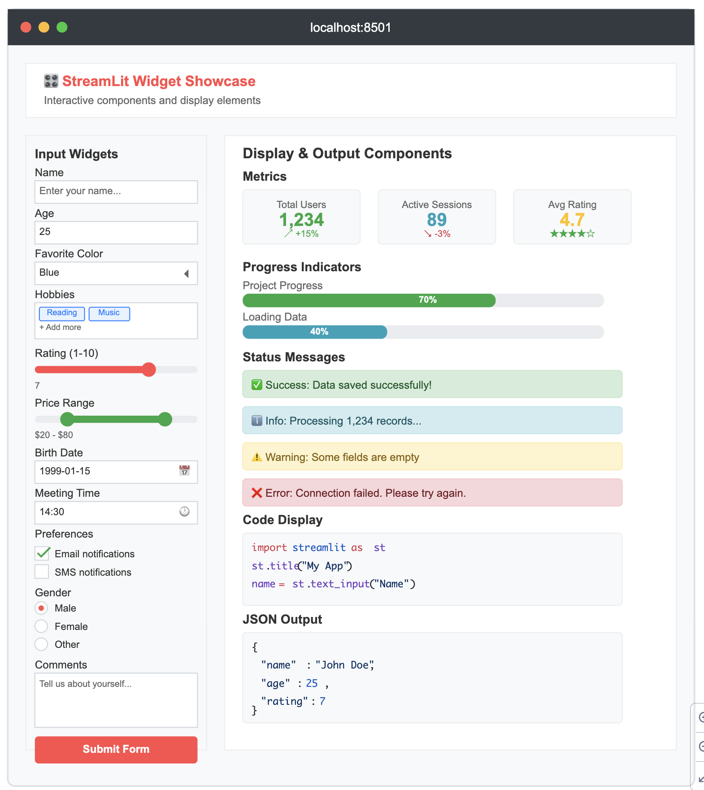

# Øvelse: Streamlit Mock-up

Lav en applikation der ligner den du kan se på billedet herunder.

De elementer du skal bruge er:

**Input Widgets (Left Sidebar):**

* st.text_input() - Name field
* st.number_input() - Age field
* st.selectbox() - Color dropdown
* st.multiselect() - Hobbies selection
* st.slider() - Rating slider
* st.select_slider() - Price range
* st.date_input() - Birth date picker
* st.time_input() - Meeting time
* st.checkbox() - Notification preferences
* st.radio() - Gender selection
* st.text_area() - Comments field
* st.button() - Submit button

**Display & Output Components (Main Area):**

* st.metric() - KPI cards with deltas
* st.progress() - Progress bars
* st.success(), st.info(), st.warning(), st.error() - Status messages
* st.code() - Syntax highlighted code
* st.json() - Formatted JSON display
