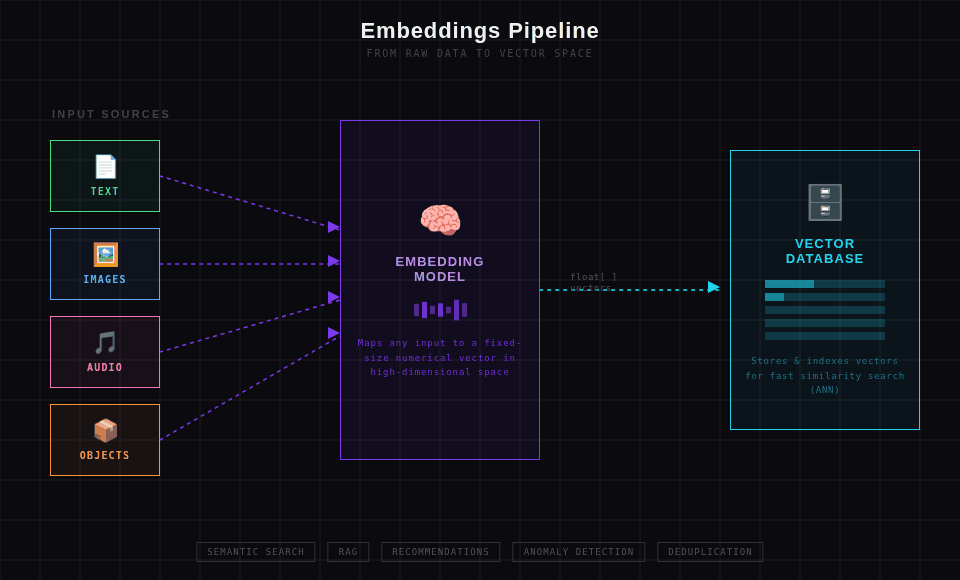

# Vector Databaser, Embeddings og søgefunktionalitet
I dag skal vi arbejde med embeddingmodels og vi skal gemme disse i en vectordatbase og i sidtse ende bruge data til at lave simularity searches.

Python bliver bindeledet, limen der binder det hele sammen. 

## Læringsmål
* På et overordnet niveau kunne forklare hvad embeddings er.
* Kunne bruge embeddings models 
* Kunne arbejde med en Vectordatabase gennem python

## Forberedelse
* [What is a Vector Database? Powering Semantic Search & AI Applications](https://www.youtube.com/watch?v=gl1r1XV0SLw)

## Dagen i dag
* [Embeddings & Vectorer]()
* [ChromaDB - Getting started](https://docs.trychroma.com/docs/overview/getting-started)

### Øvelser
